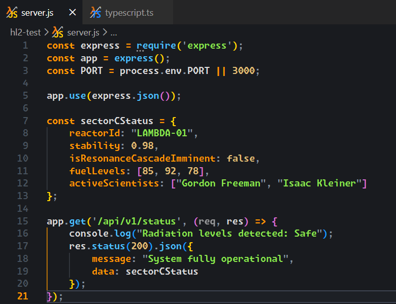

# ☢️ Half-Life Dark Theme

**A high-fidelity dark theme and sounds, inspired by City 17 and Black Mesa.**



## ✨ Features
- **Lambda Color Palette:** Carefully picked colors to feel like you're in the Half-Life universe.
- **HEV Smart Sound System:** Real-time, priority-based audio feedback for startup, terminal errors, tab switching, and file operations.
- **Icon Pack:** Custom Lambda icons for your workspace explorer.
- **Terminal Integration:** Custom wrapper to trigger Combine radio sounds when toggling the terminal (`Ctrl+J`).
- **Full Customization:** Toggle sounds globally or individually through VS Code settings.

<a id="prerequisites"></a>

## 🛠 Prerequisites

This extension provides an immersive experience with sounds from the HEV Mark IV Protective System. To enable audio features, your system requires a media player accessible via terminal.

### Sound System Requirements

| Operating System | Requirement | Installation Command |
| --- | --- | --- |
| **Windows** | PowerShell (Built-in) | No action required |
| **macOS** | afplay (Built-in) | No action required |
| **Linux** | `mpg123` | `sudo apt update && sudo apt install mpg123` |

### 🐧 Special Note for WSL2 Users

If you are using **WSL2**, please ensure:
1. You have `mpg123` installed inside your Linux distribution.
2. Your WSL2 instance is configured to output audio to Windows (standard in latest Windows 11 versions with WSLg).
3. If you don't hear sounds, ensure your PulseAudio or system sound server is correctly bridged.

### ⚠️ Troubleshooting

If the sound system fails to initialize, the extension will still function as a color and icon theme. You can check the **Extension Host** logs in the Output panel for specific error messages regarding audio playback.

<a id="installation"></a>

## 🚀 Installation Guide

You can install the **Half-Life 2 Full Experience** using one of the following methods:

### 1. Via Visual Studio Code Marketplace

1. Open **Visual Studio Code**.
2. Go to the **Extensions** view (`Ctrl+Shift+X`).
3. Search for `Half-Life Dark Theme`.
4. Click **Install**.

### 2. Manual Installation (.vsix)

If you have the compiled extension file:

1. Open your terminal in the directory where the `.vsix` file is located.
2. Run the following command:

```bash
code --install-extension half-life-dark-theme-1.0.0.vsix
```

3. Restart Visual Studio Code.

---

## ⚙️ Configuration & Commands

Once installed, the Walkthrough will guide you, but you can manually activate the modules:

### Step 1: Apply the Theme & Icons

1. Press `Ctrl+K` then `Ctrl+T` and select **"HalfLife Dark Theme"**.
2. Press `Ctrl+Shift+P`, type **"File Icon Theme"**, and choose **"Half-Life Icons"**.

### Step 2: HEV System Commands

Open the Command Palette (`Ctrl+Shift+P`) and type `HEV System` to access:

* **Enable All Sounds:** Turns on the master audio switch.
* **Disable All Sounds:** Instantly mutes the HEV system.

You can also customize exactly which events trigger sounds (like file saving, terminal errors, or tab switching) by searching for `Half-Life` in your VS Code **Settings** (`Ctrl+,`).

---

## 🛠️ Development & Customization

If you want to modify the theme or sounds for personal use:

1. Clone this repository: `git clone https://github.com/MateoRyhr/hl2-theme.git`
2. Install dependencies: `npm install`
3. Press `F5` inside VS Code to open a **Discovery Host** window and test your changes in real-time.

## 📜 Credits

This is a fan project. All audio assets and visual inspiration belong to Valve Corporation.
